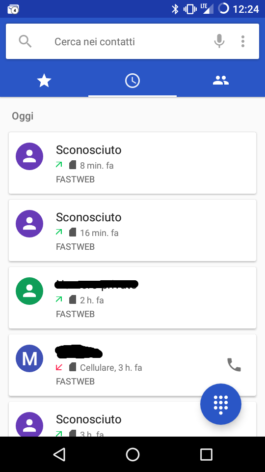
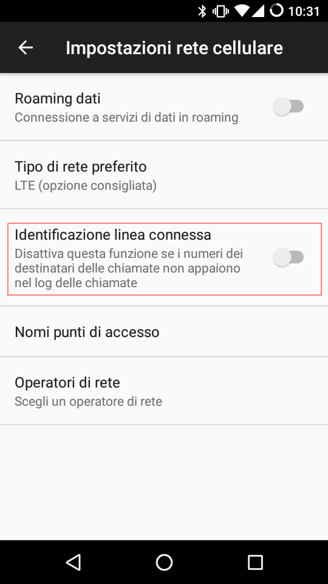

Outgoing calls are shown as "Unknown" in call history
=====================================================

My Android version is *LineageOS 14.1-20171003-NIGHTLY-g2m* but I found that similar issue is related also to other OS Version/phone.

After calling a phone number it appears as "Unknown" in the call history, also if the number is in the address book.

It can be fixed by disabling "Identificazione linea connessa" in "Impostazioni rete cellulare".

English source: https://forums.androidcentral.com/ask-question/477174-unknown-caller-id-outgoing-calls.html
